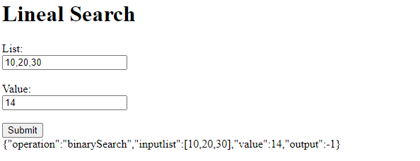
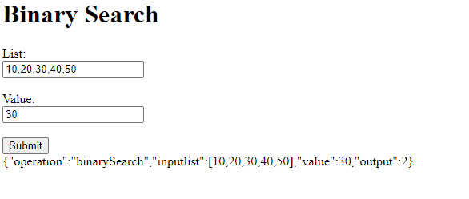
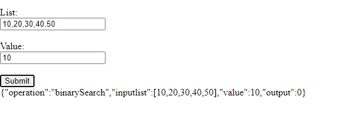
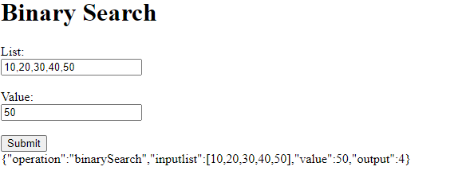
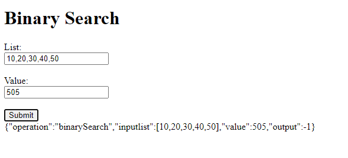

# PARCIAL SEGUNDO CORTE

---
## Descripcion:
Para el parcial desarrollamos una aplicación para buscar un objeto de en una lista por dos metodos para esto utilizamos 
la busqueda lineal y la busqueda binaria.

---
## TRABAJO HECHO:

En el tiempo del parcial logre desarrollar por completo el ***MathService***,implementando ambos algoritmos de busqueda 
con su html para poder hacer las peticiones y realizamos diferentes pruebas de funcionamiento:

__Prueba LinearSearch__

__Prueba BinarySearch__

---
## Licencia
Este proyecto está bajo la licencia de Creative Commons Reconocimiento-CompartirIgual 4.0 Internacional (CC BY-SA 4.0) - Ver el archivo [LICENSE](LICENSE.md) para más detalles.

---
### Autor:
* __Sebastian Zamora Urrego__